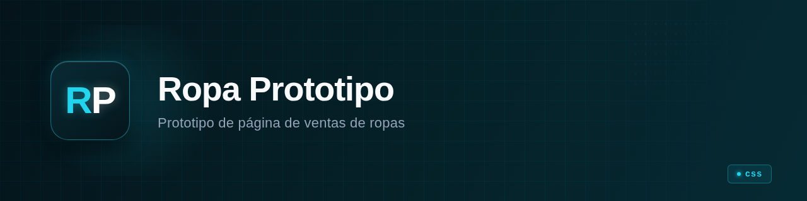

<p align="center">
  
</p>

<h1 align="center">ropa_prototipo</h1>

<p align="center"><b>Frontend-only clothing sales page prototype built with Yew (Rust/WASM) and Tailwind CSS.</b></p>

<p align="center">
  
  
  
  
</p>

---

## What it is

A single-page clothing storefront prototype. No backend, no API, no database. Just a
Yew-rendered frontend with a product catalog, category navigation (Anime, Vintage, BTS, Memes),
and product cards showing images, color/size selectors, quantity input, and "Save" / "Buy" buttons
(both non-functional).

The footer links to Instagram, TikTok, location, and legal — all placeholder `href`s.

**In one sentence:** A Rust/WASM experiment in building a clothing e-commerce UI with Yew and Tailwind.

## State

| | |
|---|---|
| **State** | prototype |
| **Last activity** | 2024-11 |
| **Usable today** | no — no backend, no working links, single viewport only |
| **What's missing** | backend/API, responsive design, product data source, working cart, deployment pipeline, tests |
| **Known risks / debt** | product data is hardcoded in `main.rs` (215 lines, all in one component); footer links go to `www.google.com`; no dark/light mode toggle |

## Why it exists

A personal experiment: can you build a clothing storefront entirely in Rust/WASM with
Yew, styled with Tailwind CSS? The answer is "partially" — the prototype renders, but
the actual product data, purchasing flow, and mobile responsiveness were never wired up.

## Demo

No demo available. The CI pipeline (`.github/workflows/rust.yml`) builds and deploys to GitHub Pages (`https://gonanf.github.io/ropa_prototipo/`), but the site may not reflect the latest state of the repo.

## Installation and usage

Requirements:
- Rust (nightly) with `wasm32-unknown-unknown` target
- Node.js 18+ (for Tailwind CSS)
- [Trunk](https://trunkrs.dev/) (`cargo install trunk`)

```bash
# Install Tailwind CSS (Node dependency)
npm install -D tailwindcss

# Build and serve for development
trunk serve

# Production build (outputs to dist/)
trunk build --release
```

The site will be served at `http://127.0.0.1:8080` by default.

## Stack

- **Language / runtime:** Rust → WebAssembly (Yew 0.21.0, CSR mode)
- **Styling:** Tailwind CSS 3.4 (scanned from `src/**/*.rs`), custom CSS patterns (`custom.css`)
- **Build tooling:** Trunk (Rust WASM bundler), npm (Tailwind only)
- **CI:** GitHub Actions — builds with Rust nightly + Trunk, deploys to GitHub Pages
- **What it does NOT use:** No backend framework, no state management library, no router — intentionally bare

## Architecture

```
index.html          →  Trunk entry point, loads CSS
src/main.rs         →  Single Yew App component (215 lines), all UI in one file
tailwind.config.js  →  Scans Rust source for class names
custom.css          →  Pattern backgrounds for product categories + SVG animations
Trunk.toml          →  Build config, hooks into Tailwind before each build
img/                →  Product images, banners, logos, SVG assets
```

```
index.html  →  Trunk  →  WASM (main.rs)  →  Browser
```

## Repo structure

```
src/main.rs          # The entire application — navbar, product catalog, product cards, footer
index.html           # Trunk HTML shell
tailwind.config.js   # Tailwind: scans src/**/*.rs for class usage
custom.css           # Category-specific hover patterns, SVG text animations, wave background
Trunk.toml           # Build config: dist/ output, Tailwind hook
Cargo.toml           # Rust package: yew 0.21.0 with CSR feature
package.json         # Node: only tailwindcss devDependency
img/                 # Product images, banners, logos (26 files)
.github/workflows/   # CI: build + deploy to GitHub Pages
docs/overview.md     # Auto-generated overview (from a previous documentation run)
```

## Roadmap

- [ ] Backend integration (product data, cart, user accounts)
- [ ] Responsive design (currently single-viewport only)
- [ ] Product data externalized (JSON/API instead of hardcoded in `main.rs`)
- [ ] Working search functionality
- [ ] Mobile layout
- [x] Initial product card UI with hover effects
- [x] Category navigation with animated backgrounds

## Notes and decisions

- **Yew CSR over SSR:** The project uses `yew = { features=["csr"] }` — client-side rendering only. No server-side rendering, no routing. This is the simplest Yew setup and matches the prototype scope.
- **Trunk as bundler:** Chosen because it's the standard Yew build tool and handles WASM compilation + asset copying + dev server in one command. No custom webpack/vite setup needed.
- **Tailwind scanned from Rust:** `tailwind.config.js` scans `src/**/*.rs` for class names. This is the standard Yew+Tailwind approach — Yew's `html!` macro embeds CSS class names as string literals.
- **Single-component architecture:** All 215 lines of `main.rs` are in one `App` component. Fine for a prototype; would need component extraction before any real feature work.
- **No tests, no linting:** No `#[cfg(test)]`, no CI test step. The CI only builds and deploys. This is typical for a quick prototype but would need fixing before any production use.

## License

Private — no license file present. Not open source.

---

<!-- Template rules applied: no marketing adjectives, no invented features, honest state declaration, ~150 lines. -->
